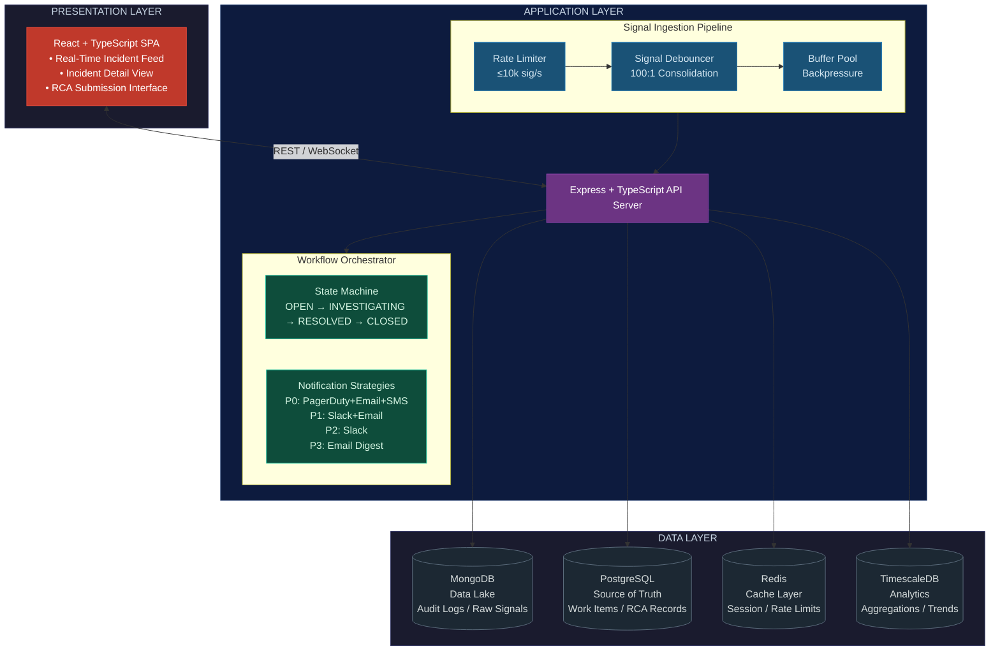
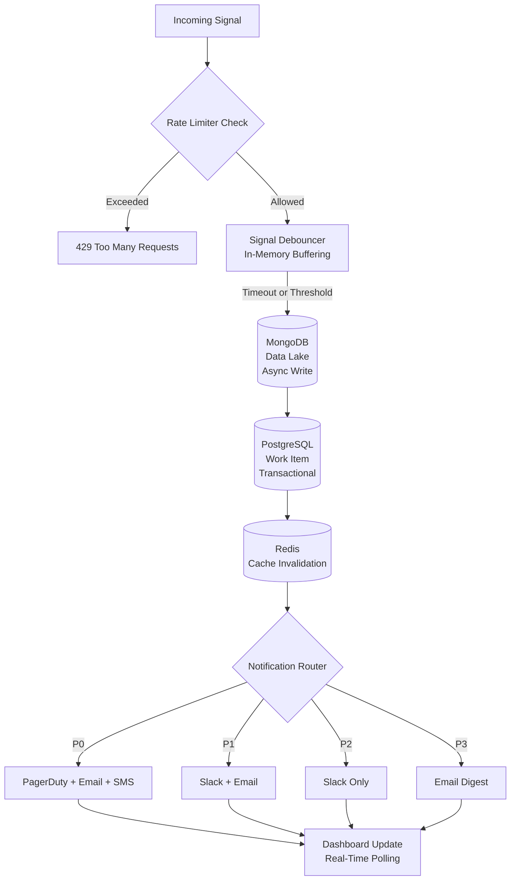

# Mission-Critical Incident Management System (IMS)

A resilient, enterprise-grade Incident Management System designed to handle high-volume signal ingestion, intelligent incident correlation, and streamlined workflow-driven resolution with mandatory Root Cause Analysis (RCA).

## 🎯 Overview

The IMS monitors complex distributed stacks (APIs, MCP Hosts, Distributed Caches, Async Queues, RDBMS, NoSQL stores) and manages failure mediation through:

- **High-throughput signal ingestion** (up to 10,000 signals/sec)
- **Intelligent debouncing** (100 signals → 1 Work Item in 10 seconds)
- **Multi-tier storage architecture** (Data Lake, Source of Truth, Cache, Aggregations)
- **Design pattern-driven workflow** (Strategy & State patterns)
- **Mandatory RCA for closure** with automatic MTTR calculation
- **Real-time dashboard** for incident tracking and management

## 🏗️ System Architecture

The following diagram illustrates the high-level architecture of the Incident Management System, organized into three primary layers:

- **Presentation Layer** — React-based SPA for incident monitoring and RCA submission
- **Application Layer** — Express API server with signal ingestion pipeline and workflow orchestration
- **Data Layer** — Polyglot persistence with specialized databases for each concern



## 📦 Tech Stack

### Backend
- **Runtime**: Node.js + TypeScript
- **API Framework**: Express.js
- **Concurrency**: Native Async/Await
- **Databases**:
  - **MongoDB**: Data Lake (raw signal audit logs)
  - **PostgreSQL**: Source of Truth (Work Items + RCA)
  - **Redis**: Cache (Real-time Dashboard State)

### Frontend
- **Framework**: React 18 + TypeScript
- **Build Tool**: Vite
- **Styling**: CSS3
- **HTTP Client**: Axios

### Infrastructure
- **Containerization**: Docker + Docker Compose
- **Orchestration**: Docker Compose (local) / Kubernetes (production)

## 📚 Docs

The repository includes a [docs/](/docs/) folder with detailed guides and examples:

- [docs/ARCHITECTURE.md](/docs/ARCHITECTURE.md) — System design, diagrams, and component responsibilities.
- [docs/API_EXAMPLES.md](/docs/API_EXAMPLES.md) — API usage examples (curl, Python, JavaScript).
- [docs/DEPLOYMENT.md](/docs/DEPLOYMENT.md) — Deployment instructions and Docker Compose reference.
- [docs/SERVICE_STATUS.md](/docs/SERVICE_STATUS.md) — Service status page implementation and monitoring details.
- [PROJECT_SUMMARY.md](/PROJECT_SUMMARY.md) — High-level project summary and run/test snippets.

Open these files in the repository or view them rendered in your editor for more details.

## 🚀 Quick Start

### Prerequisites
- Docker & Docker Compose
- Node.js 20+ (for local development)
- Git

### Option 1: Docker Compose (Recommended)

```bash
# Clone or navigate to project
cd Incident-Management-System

# Start all services
docker-compose up --build -d

# View logs
docker-compose logs -f backend

# Generate sample incidents
cd backend
npm install
npm run generate-sample-data
```

Access the system:
- **Dashboard**: http://localhost:3000
- **API**: http://localhost:3001/api
- **Health**: http://localhost:3001/api/health
- **OpenAPI**: http://localhost:3001/api/openapi.json
- **Swagger UI**: http://localhost:3001/api/docs

## 🔒 Non-Functional Considerations

The system is designed with operational and platform concerns in mind, not just feature delivery:

- **Security controls** — CORS is enabled at the API layer, request payloads are parsed centrally, and the signal pipeline applies rate limiting to protect the backend from traffic spikes.
- **Input safety** — Key workflow and RCA paths validate required fields, state transitions, identifiers, and timestamps before data is accepted.
- **Performance** — Signal debouncing reduces write amplification, Redis caching shortens hot-path reads, and the storage layer uses connection pooling to keep throughput stable under load.
- **Resilience** — Retry with exponential backoff, cache-based locking, and graceful shutdown handling help the platform recover cleanly from transient failures.
- **Scalability** — The architecture separates ingestion, persistence, and analytics so each layer can be tuned independently as traffic grows.
- **Observability** — Health endpoints, OpenAPI docs, structured logging, and rate-limit metrics make the service easier to operate and debug.

### Option 2: Local Development

```bash
# Setup Backend
cd backend
npm install
npm run build
npm run dev  # Starts on port 3001

# Generate sample incidents
npm run generate-sample-data

# In another terminal - Setup Frontend
cd frontend
npm install
# Start frontend dev server with the local backend proxy
npm run dev  # Starts on port 3000

# Ensure databases are running (see docker-compose.yml)
```

## 🔄 Backpressure Handling

The system implements multiple layers of backpressure management:

### 1. **Rate Limiting (First Line of Defense)**
```
Max Throughput: 10,000 signals/second
Window: 60 seconds
Response: HTTP 429 if exceeded
Strategy: Token bucket algorithm
```

**Implementation**:
- Tracks timestamp of each request in a sliding window
- Rejects requests when limit exceeded
- Provides remaining quota in response headers
- Prevents cascading failures from overwhelming the system

### 2. **Signal Debouncing (In-Memory Buffering)**
```
Window: 10 seconds
Threshold: 100 signals for same component
Action: Create 1 Work Item + batch link all signals
```

**Benefits**:
- Reduces database writes by 100x in bursty scenarios
- Prevents database saturation
- Maintains memory efficiency with per-component buckets
- Auto-flush after timeout or threshold

### 3. **Async Processing (Queue-Based)**
```
Architecture: Bull Queue (Redis-backed)
Workers: Configurable thread pool
Retry Logic: Exponential backoff (3-5 attempts)
Dead Letter Queue: Failed jobs for manual review
```

**Benefits**:
- Decouples ingestion from storage
- Prevents API timeout during heavy loads
- Automatic retry with exponential backoff
- Dead letter queue for failed operations

### 4. **Database Connection Pooling**
```
PostgreSQL Pool Size: 20 connections
MongoDB Connection Pool: 10 connections
Redis Connection Pool: 5 connections
```

**How It Works**:
- Limits concurrent database connections
- Queues requests when pool exhausted
- Prevents connection leaks
- Auto-reconnect on failures

### 5. **Cache-as-Primary (Hot Path)**
```
Dashboard State: Cached for 3 seconds
Work Item Detail: Cached for 300 seconds
Cache Invalidation: On updates
```

Config: Set `DASHBOARD_CACHE_TTL_SECONDS` (seconds) to override the default dashboard cache TTL (default: 3).

**Benefits**:
- Reduces source of truth queries by 90%
- Improves dashboard responsiveness
- Prevents thundering herd on database

## Signal Processing Flow

When a signal enters the system, it passes through the following pipeline:

1. **Rate Limiting** — Rejects excess traffic with `429` responses
2. **Debouncing** — Consolidates bursts of up to 100 related signals
3. **Persistence** — Async write to MongoDB Data Lake, then transactional write to PostgreSQL
4. **Cache Invalidation** — Clears affected Redis keys
5. **Alerting** — Severity-based routing through the Notification Router
6. **Dashboard** — Real-time UI updates via polling



## 🎨 Design Patterns Used

### 1. Strategy Pattern (Alerting)
Dynamically selects alert strategy based on component type:

```typescript
// Different strategies for different severity levels
- RdbmsAlertStrategy: P0 → PagerDuty + SMS + Email
- McpQueueAlertStrategy: P1 → Slack + Email
- CacheAlertStrategy: P2 → Slack only
- ApiAlertStrategy: P3 → Email only

// Usage
const strategy = AlertStrategyFactory.getStrategy(componentType);
const channels = strategy.getAlertChannels();
const message = strategy.formatMessage(componentId, error);
```

### 2. State Pattern (Work Item Lifecycle)
Manages incident state transitions with validation:

```typescript
// Valid transitions
OPEN → INVESTIGATING → RESOLVED → CLOSED (with RCA)

// State context enforces rules
- Can only close if RCA is complete
- Cannot transition backward from CLOSED
- Validates each state change
```

## 📊 Storage Architecture

### Data Lake (MongoDB)
**Purpose**: Immutable audit trail of all signals
```
Collection: signals
Indexes: 
  - componentId + timestamp
  - timestamp DESC
  - severity
Query Pattern: Fetch raw signals for RCA context
```

### Source of Truth (PostgreSQL)
**Purpose**: Single source of truth for incidents and RCA
```
Tables:
  - work_items: Incident metadata + state
  - rcas: Root cause analysis records
Constraints: Transactional ACID compliance
```

### Cache (Redis)
**Purpose**: Real-time dashboard state
```
Keys:
  - work_item:{id}: Current incident state (TTL: 300s)
  - dashboard:state: Aggregated dashboard (TTL: 10s) — configurable via `DASHBOARD_CACHE_TTL_SECONDS`
  - signals:{componentId}:{hour}: Hourly aggregations
  - metric:{name}: System metrics
```

### Aggregations (Time-Series)
**Purpose**: Analytics and historical trends
```
Data:
  - Signal count per component per minute
  - Average latency trends
  - Component health history
Retention: 7 days (configurable)
```

## 📈 Performance Characteristics

| Metric | Target | Implementation |
|--------|--------|-----------------|
| Signal Ingestion | 10,000 signals/sec | Rate limiter + debouncer |
| API Response Time | < 200ms (p99) | Cache-first + async indexing |
| Work Item Creation | < 500ms | Batch + async writes |
| Dashboard Refresh | < 2s | Cached state + polling |
| MTTR Calculation | < 1s | In-memory computation |
| RCA Submission | < 2s | Transactional write + cache invalidate |

## 🧪 Testing

### Unit Tests
```bash
cd backend
npm test
```

Tests cover:
- RCA validation logic (mandatory fields)
- MTTR calculation accuracy
- State transition rules
- Alert strategy selection
- Rate limiter behavior
- Debouncer logic

### Integration Tests (Sample Data)
```bash
cd backend
npm run generate-sample-data
# Sends 8 signals simulating RDBMS failure → cascading issues
```

### Run Health Check Tests:
```bash
cd backend
npm test -- health-check.test.ts
```
### Run openAPI Tests:
```bash
cd backend
npm test -- openapi.test.ts
```
### Load Testing
```bash
# Coming soon: k6 load test script
# Will simulate 10,000 signals/sec burst
```

## 📋 API Endpoints

### Signals
```
POST /api/signals
  • Ingest a single signal
  • Rate limited to 10,000/sec
  • Returns: { signalId, message }

POST /api/signals/batch
  • Ingest multiple signals (up to 1,000)
  • Returns: { count, message }
```

### Incidents
```
GET /api/incidents
  • List all active incidents
  • Sorted by severity + recency
  • Returns: { data, total }

GET /api/incidents/:id
  • Get incident details
  • Returns: { WorkItem with RCA if available }

PUT /api/incidents/:id/status
  • Transition incident state
  • Validates state changes
  • Returns: Updated WorkItem

POST /api/incidents/:id/rca
  • Submit RCA (mandatory for closure)
  • Auto-transitions to CLOSED
  • Calculates MTTR
  • Returns: { rca, message }
```

### System
```
GET /api/health
  • Health check
  • Returns: { status, uptime, rateLimiter metrics }
```

## 📊 Dashboard Features

### 1. Live Feed
- Real-time incident list sorted by severity (P0-P3)
- Filter by status (OPEN, INVESTIGATING, RESOLVED)
- Auto-refresh every 5 seconds
- Signal count per incident
- Emit Random Signal action to generate and ingest a randomized signal for quick testing
- Simulate Cascading Failure action to trigger a multi-signal failure scenario and populate related incidents

### 2. Incident Detail
- Full incident timeline
- Raw signals grouped by timestamp
- Component information
- RCA history (if available)
- Status transition controls

### 3. RCA Form
- Incident start/end datetime pickers
- Root cause category dropdown
- Fix applied text area
- Prevention steps text area
- Automatic MTTR calculation
- Mandatory field validation
- Auto-closure on submission


## 📝 Environment Variables

See `.env.example` in backend and frontend directories

```bash
# Backend
PORT=3001
REDIS_URL=redis://localhost:6379
MONGO_URL=mongodb://localhost:27017/ims
DB_HOST=localhost
DB_USER=postgres
RATE_LIMIT_MAX_SIGNALS=10000
```
